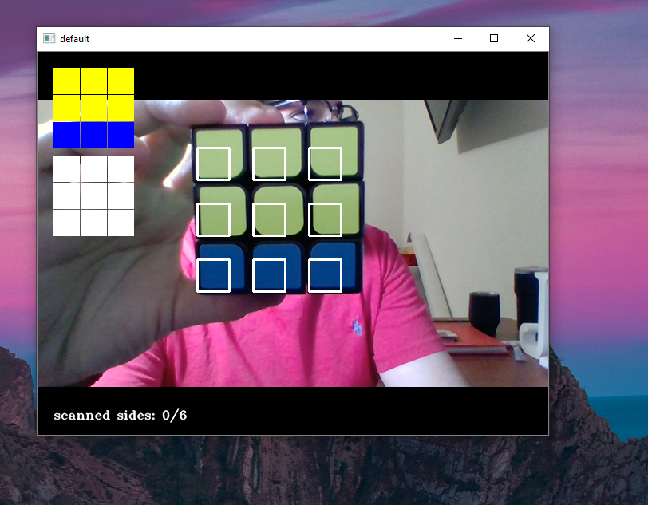
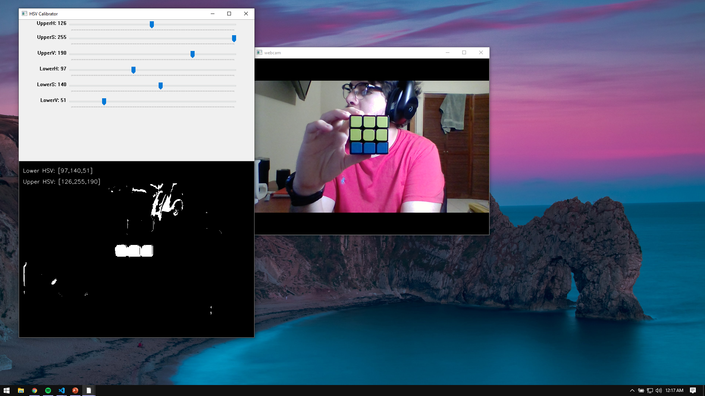
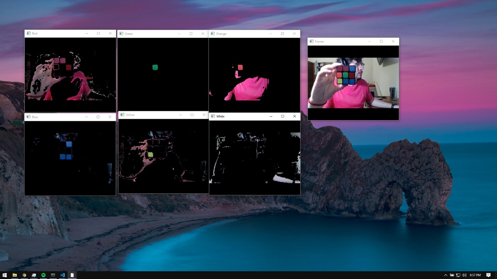
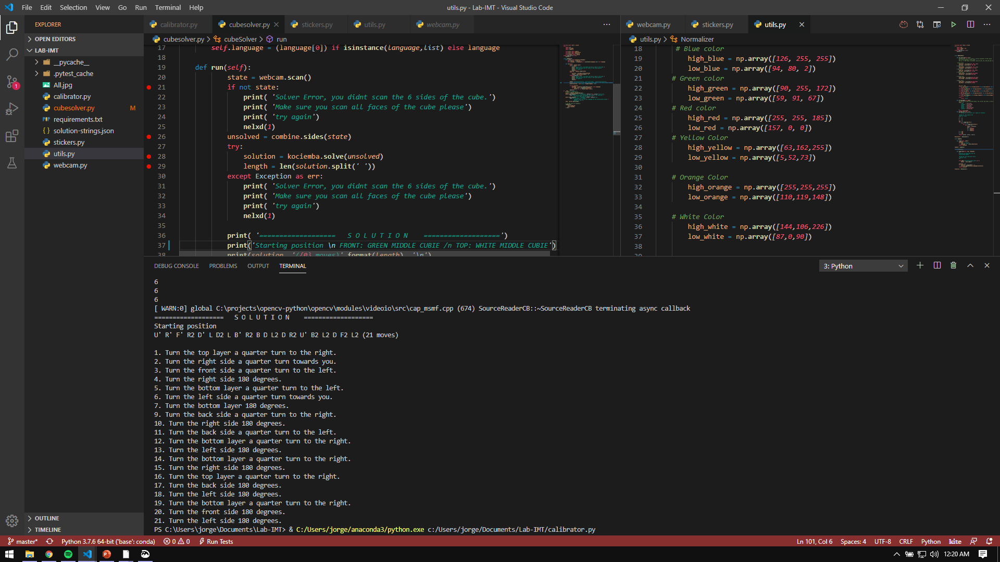

# Lab-IMT Rubik's Cube Solver

## Setup 
For you to be able to run this project, you have to create a virtualenv on python with Python 3.8.2 (Anaconda is recommended). 

### in Anaconda Prompt
```
git clone https://github.com/jorgegarcia197/Lab-IMT.git
cd Lab-IMT
pip install -r requirements.txt
code . 
```

After the code is executed, the first thing you'll notice is the workspace, if you want to go straight to the solver run 

```
python cubesolver.py
```
The next thing you'll see is the camera popping up with the rectangles. Something like this. 



The test runs were done in a very controlled environment with controlled lighting, this is why we implemented a calibrator when you will be able to figure out which are the recommended upper and lower boundaries of the HSV for every color. 
Within the root folder run: 
```
python calibrator.py
```

which will display two different tabs such as these: 

 

After that, you can parse all your arguments in a different file called *webcam.py*. To run in, you just need to type:
```
python webcam.py
```
If you calibrated your colors correctly, you will see somehting like this pop up in the different windows



If you are happy with the calibration, jump to the *utils.py* into the *DetectColor* class where you will be able to parse the arguments from the webcam file to accurately track the colors in your cube 

## The Cube Solver

In order to track the code perfectly, we strongly suggest to track which is your starting cube face in order to assign the colors of the other faces correspondingly
if you want to take a look at the library, refer to: 

* [Kociembra Python Library](https://github.com/muodov/kociemba)

## Solution 

After you have scanned all of the 6 different faces of the cube correctly, you will be given the solution (it will be printed on terminal) 
The starting point of the solution is **always with the green center cubie as the front face and the white center cubie as the top face**




# DEMO 
[Video Presentation with all the steps aforementioned](https://drive.google.com/open?id=1RDCXruvJYaT_U2iTOshzxpVw3NKJT1fm)

## Team
| Name | Student Number|
|-----|---------|
|Jorge Garcia Serna | A00516604|
|Mariana Aguilar Gamboa|A00818651|
|Juan Pablo Rios Siliceo| A01329611|
|Adrian Trujillo Duron| A01176152|
